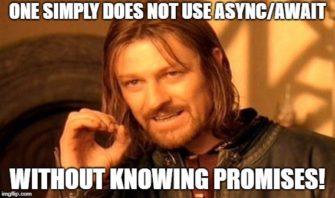

# 0x01. ES6 Promises

* Learning Objectives
At the end of this project, you are expected to be able to explain to anyone, without the help of Google:

  - Promises (how, why, and what)
  - How to use the then, resolve, catch methods
  - How to use every method of the Promise object
  - Throw / Try
  - The await operator
  - How to use an async function
* Requirements
  - All your files will be executed on Ubuntu 18.04 LTS using NodeJS 12.11.x
  - Allowed editors: vi, vim, emacs, Visual Studio Code
  - All your files should end with a new line
  - A README.md file, at the root of the folder of the project, is mandatory
  - Your code should use the js extension
  - Your code will be tested using Jest and the command npm run test
  - Your code will be verified against lint using ESLint
  - All of your functions must be exported
* Resources
* Read or watch:
  * [Promise](https://intranet.alxswe.com/rltoken/8IEjDdrFqrfsXUV9frNmKA) and [Promise w3c](https://www.w3schools.com/js/js_promise.asp)
  * [JavaScript Promise: An introduction](https://intranet.alxswe.com/rltoken/EnBUkluIIlLr0Z3dRJV4LQ)
  * [Await](https://intranet.alxswe.com/rltoken/SALOZ-GAD5GVCTnK1iTCdA)
  * [Async](https://intranet.alxswe.com/rltoken/QZMWLFR29PO2bVOS4_8j5Q)
  * [Throw / Try](https://intranet.alxswe.com/rltoken/TXqH5zA1NSVCwCoyr1cNxg)
  
# Tasks

## 0. [Keep every promise you make and only make promises you can keep](https://github.com/gama1221/alx-frontend-javascript/blob/main/0x01-ES6_promise/0-promise.js)
    - Return a Promise using this prototype function getResponseFromAPI()
```js
const response = getResponseFromAPI();
console.log(response instanceof Promise);
```
## 1. [Don't make a promise...if you know you can't keep it](https://github.com/gama1221/alx-frontend-javascript/blob/main/0x01-ES6_promise/1-block-scoped.js)
    - Using the prototype below, return a promise. The parameter is a boolean.
    - When the argument is:
    - true
      - resolve the promise by passing an object with 2 attributes:
        - status: 200
        - body: 'Success'
```javascript
export default function taskBlock(trueOrFalse) {
    var task = false;
    var task2 = true;

    if (trueOrFalse) {
        var task = true;
        var task2 = false;
    }

    return [task, task2];
    }
```
## 2. [Catch me if you can!](https://github.com/gama1221/alx-frontend-javascript/blob/main/0x01-ES6_promise/2-then.js)
    - Using the function prototype below
    Append three handlers to the function:

    - When the Promise resolves, return an object with the following attributes
      - status: 200
      - body: success
    - When the Promise rejects, return an empty Error object
    - For every resolution, log Got a response from the API to the console
    
```js
bob@dylan:~$ cat 2-main.js
import handleResponseFromAPI from "./2-then";

const promise = Promise.resolve();
handleResponseFromAPI(promise);

bob@dylan:~$ 
bob@dylan:~$ npm run dev 2-main.js 
Got a response from the API
bob@dylan:~$ 
```

## 3. [Handle multiple successful promises](https://github.com/gama1221/alx-frontend-javascript/blob/main/0x01-ES6_promise/3-all.js)
  - In this file, import uploadPhoto and createUser from utils.js
  - Knowing that the functions in utils.js return promises, use the prototype below to collectively resolve all promises and log body firstName lastName to the console.
```js
function handleProfileSignup()
```
In the event of an error, log Signup system offline to the console
```js
bob@dylan:~$ cat 3-main.js
import handleProfileSignup from "./3-all";

handleProfileSignup();

bob@dylan:~$ 
bob@dylan:~$ npm run dev 3-main.js 
photo-profile-1 Guillaume Salva
bob@dylan:~$ 
```
## 4. [Simple promise](https://github.com/gama1221/alx-frontend-javascript/blob/main/0x01-ES6_promise/4-user-promise.js)
    - Using the following prototype
```js
function signUpUser(firstName, lastName) {
}
```
  - That returns a resolved promise with this object:
```js
{
  firstName: value,
  lastName: value,
}
bob@dylan:~$ cat 4-main.js
import signUpUser from "./4-user-promise";

console.log(signUpUser("Bob", "Dylan"));

bob@dylan:~$ 
bob@dylan:~$ npm run dev 4-main.js 
Promise { { firstName: 'Bob', lastName: 'Dylan' } }
bob@dylan:~$ 
```

## 5. [Reject the promises](https://github.com/gama1221/alx-frontend-javascript/blob/main/0x01-ES6_promise/5-photo-reject.js)
    - Write and export a function named uploadPhoto. It should accept one argument fileName (string).
    - The function should return a Promise rejecting with an Error and the string $fileName cannot be processed
```js
export default function uploadPhoto(filename) {

}
bob@dylan:~$ cat 5-main.js
import uploadPhoto from './5-photo-reject';

console.log(uploadPhoto('guillaume.jpg'));

bob@dylan:~$ 
bob@dylan:~$ npm run dev 5-main.js 
Promise {
  <rejected> Error: guillaume.jpg cannot be processed
  ..
    ..
bob@dylan:~$ 
```

## 6. [Handle multiple promises](https://github.com/gama1221/alx-frontend-javascript/blob/main/0x01-ES6_promise/6-final-user.js)
    - Import signUpUser from 4-user-promise.js and uploadPhoto from 5-photo-reject.js.
    - Write and export a function named handleProfileSignup. It should accept three arguments firstName (string), lastName (string), and fileName (string). The function should call the two other functions. When the promises are all settled it should return an array with the following structure:
```js
[
    {
      status: status_of_the_promise,
      value: value or error returned by the Promise
    },
    ...
  ]
bob@dylan:~$ cat 6-main.js
import handleProfileSignup from './6-final-user';

console.log(handleProfileSignup("Bob", "Dylan", "bob_dylan.jpg"));

bob@dylan:~$ 
bob@dylan:~$ npm run dev 6-main.js 
Promise { <pending> }
bob@dylan:~$ 
```

## 7. [Load balancer](https://github.com/gama1221/alx-frontend-javascript/blob/main/0x01-ES6_promise/7-load_balancer.js)
    - Write and export a function named loadBalancer. It should accept two arguments chinaDownload (Promise) and USDownload (Promise).
    - The function should return the value returned by the promise that resolved the first.
```js
export default function loadBalancer(chinaDownload, USDownload) {

}
bob@dylan:~$ cat 7-main.js
import loadBalancer from "./7-load_balancer";

const ukSuccess = 'Downloading from UK is faster';
const frSuccess = 'Downloading from FR is faster';

const promiseUK = new Promise(function(resolve, reject) {
    setTimeout(resolve, 100, ukSuccess);
});

const promiseUKSlow = new Promise(function(resolve, reject) {
    setTimeout(resolve, 400, ukSuccess);
});

const promiseFR = new Promise(function(resolve, reject) {
    setTimeout(resolve, 200, frSuccess);
});

const test = async () => {
    console.log(await loadBalancer(promiseUK, promiseFR));
    console.log(await loadBalancer(promiseUKSlow, promiseFR));
}

test();

bob@dylan:~$ 
bob@dylan:~$ npm run dev 7-main.js 
Downloading from UK is faster
Downloading from FR is faster
bob@dylan:~$ 
```

## 8. [Throw error / try catch](https://github.com/gama1221/alx-frontend-javascript/blob/main/0x01-ES6_promise/8-try.js)
    - Write a function named divideFunction that will accept two arguments: numerator (Number) and denominator (Number).
    - When the denominator argument is equal to 0, the function should throw a new error with the message cannot divide by 0. Otherwise it should return the numerator divided by the denominator.

```js
export default function divideFunction(numerator, denominator) {

}
bob@dylan:~$ cat 8-main.js
import divideFunction from './8-try';

console.log(divideFunction(10, 2));
console.log(divideFunction(10, 0));

bob@dylan:~$ 
bob@dylan:~$ npm run dev 8-main.js 
5
..../8-try.js:15
  throw Error('cannot divide by 0');
  ^
.....

bob@dylan:~$ 
```

## 9. [Throw an error](https://github.com/gama1221/alx-frontend-javascript/blob/main/0x01-ES6_promise/9-getFullBudget.js)
    - Write a function named guardrail that will accept one argument mathFunction (Function).

    - This function should create and return an array named queue.

    - When the mathFunction function is executed, the value returned by the function should be appended to the queue. If this function throws an error, the error message should be appended to the queue. In every case, the message Guardrail was processed should be added to the queue.

    - Example:
```js
[
  1000,
  'Guardrail was processed',
]
bob@dylan:~$ cat 9-main.js
import guardrail from './9-try';
import divideFunction from './8-try';

console.log(guardrail(() => { return divideFunction(10, 2)}));
console.log(guardrail(() => { return divideFunction(10, 0)}));

bob@dylan:~$ 
bob@dylan:~$ npm run dev 9-main.js 
[ 5, 'Guardrail was processed' ]
[ 'Error: cannot divide by 0', 'Guardrail was processed' ]
bob@dylan:~$ 
```

## 10. [ Await / Async](https://github.com/gama1221/alx-frontend-javascript/blob/main/0x01-ES6_promise/100-await.js)
Import uploadPhoto and createUser from utils.js

Write an async function named asyncUploadUser that will call these two functions and return an object with the following format:
```js
{
  photo: response_from_uploadPhoto_function,
  user: response_from_createUser_function,
}
```
If one of the async function fails, return an empty object. Example:
```js
{
  photo: null,
  user: null,
}
bob@dylan:~$ cat 100-main.js
import asyncUploadUser from "./100-await";

const test = async () => {
    const value = await asyncUploadUser();
    console.log(value);
};

test();

bob@dylan:~$ 
bob@dylan:~$ npm run dev 100-main.js 
{
  photo: { status: 200, body: 'photo-profile-1' },
  user: { firstName: 'Guillaume', lastName: 'Salva' }
}
bob@dylan:~$ 
```

## 9. [Throw an error](https://github.com/gama1221/alx-frontend-javascript/blob/main/0x01-ES6_promise/9-getFullBudget.js)
    - Write a function named guardrail that will accept one argument mathFunction (Function).

    - This function should create and return an array named queue.

    - When the mathFunction function is executed, the value returned by the function should be appended to the queue. If this function throws an error, the error message should be appended to the queue. In every case, the message Guardrail was processed should be added to the queue.

    - Example:
```js
[
  1000,
  'Guardrail was processed',
]
bob@dylan:~$ cat 9-main.js
import guardrail from './9-try';
import divideFunction from './8-try';

console.log(guardrail(() => { return divideFunction(10, 2)}));
console.log(guardrail(() => { return divideFunction(10, 0)}));

bob@dylan:~$ 
bob@dylan:~$ npm run dev 9-main.js 
[ 5, 'Guardrail was processed' ]
[ 'Error: cannot divide by 0', 'Guardrail was processed' ]
bob@dylan:~$ 
```


## Author
# Getinet [LinkedIn](https://www.linkedin.com/in/getinet-mekonnen/)